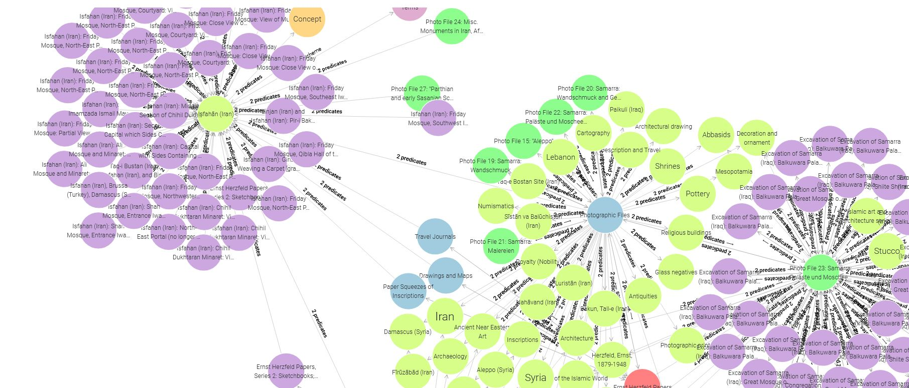

# `On the Construction`...
# Herzfeld Archive Data Extraction and RDF Transformation

This repository contains tools to extract metadata from the [Ernst Herzfeld Papers](https://sova.si.edu/record/fsa.a.06), transform a subset of the data into Turtle (TTL) format using a custom ontology, and query the resulting RDF data with SPARQL. The project focuses on the archival structure of series, subseries, and resources (files and items) from the Smithsonian's Freer and Sackler Archives.
While using the Smithsonian Official API to search for IIIF resources on Ernst Herzfeld, I discovered a significant XML file. It appeared to be the primary data source for Herzfeld's documents on the Smithsonian website.
I extracted relevant data, focusing on the structure of collections, series, and subseries. This file contains well-integrated data with Wikidata, LCSH, and AAT, making it ideal for creating a Knowledge Graph to highlight key entities and their relationships. Despite the advanced technologies at the Smithsonian, including an Open Access RESTful API, they lack a machine-readable catalog.



## Table of Contents
- [Project Overview](#project-overview)
- [Repository Structure](#repository-structure)
- [Prerequisites](#prerequisites)
- [Installation](#installation)
- [Usage](#usage)
- [Ontology](#ontology)
- [Sample Data](#sample-data)
- [SPARQL Queries](#sparql-queries)
- [Contributing](#contributing)
- [License](#license)

## Project Overview
The Ernst Herzfeld Papers (FSA A.06) document the archaeological work of Ernst Herzfeld (1879–1948). This project:
1. **Extracts** metadata from the EAD XML file using Python (`extract_herzfeld_data.py`).
2. **Transforms** a subset of the JSON output into Turtle format using RDFlib (`transform_to_ttl.py`) and a custom ontology (`herzfeld_ontology.ttl`).
3. **Queries** the RDF data with SPARQL examples to retrieve specific information (e.g., resources with digital images).

The sample data focuses on subseries `ref6808` (“Ernst Herzfeld’s Sketchbooks”) with resources like `ref6809` (file) and `ref6810` (item).

## Repository Structure
```
herzfeld-rdf/
├── extract_herzfeld_data.py      # Script to extract JSON from XML
├── transform_to_ttl.py           # Script to convert JSON to Turtle
├── herzfeld_ontology.ttl         # Custom ontology for Herzfeld data
├── imgsrc                        # Images used in readme.md
├── output.ttl                    # Generated Turtle file
├── queries/
│   ├── query1.rq                 # SPARQL: List items with digital images
│   ├── query2.rq                 # SPARQL: Find resources by control access term
├── README.md                     # This file
└── LICENSE                       # MIT License
```

## Prerequisites
- Python 3.8+
- Libraries: `lxml`, `requests`, `rdflib`
- SPARQL client (e.g., `rdflib` or a triplestore like Apache Jena Fuseki)

## Installation
1. Clone the repository:
   ```bash
   git clone https://github.com/yourusername/herzfeld-rdf.git
   cd herzfeld-rdf
   ```
2. Install dependencies:
   ```bash
   pip install lxml requests rdflib
   ```
3. (Optional) Set up a triplestore (e.g., Fuseki) for SPARQL queries:
   - Download and run Apache Jena Fuseki.
   - Load `output.ttl` into a dataset.

## Usage
1. **Extract JSON**:
   Run the extraction script to download and process the XML:
   ```bash
   python extract_herzfeld_data.py
   ```
   This generates `herzfeld_archive.json`. For testing, use `sample_data.json`.

2. **Transform to Turtle**:
   Convert the JSON to Turtle using the ontology:
   ```bash
   python transform_to_ttl.py
   ```
   This generates `output.ttl`.

3. **Run SPARQL Queries**:
   - Use `rdflib` to query `output.ttl` locally:
     ```python
     from rdflib import Graph
     g = Graph()
     g.parse("output.ttl", format="turtle")
     q = open("queries/query1.rq").read()
     results = g.query(q)
     for row in results:
         print(row)
     ```
   - Or load `output.ttl` into a triplestore and query via its SPARQL endpoint.

## Ontology
The custom ontology (`herzfeld_ontology.ttl`) defines classes and properties for the Herzfeld archive, aligned with Dublin Core and CIDOC-CRM where applicable.

### Namespace
- `herz: <http://example.org/herzfeld#>`

### Classes
- `herz:Series`: A top-level archival series.
- `herz:Subseries`: A subdivision of a series.
- `herz:Resource`: An archival resource (subclasses: `herz:File`, `herz:Item`).
- `herz:DigitalObject`: A digital representation of a resource.
- `herz:ControlAccessTerm`: A controlled vocabulary term (e.g., geographic or genre).

### Properties
- **Object Properties**:
  - `herz:hasSubseries`: Links `Series` to `Subseries`.
  - `herz:hasResource`: Links `Subseries` to `Resource`.
  - `herz:hasDigitalObject`: Links `Resource` to `DigitalObject`.
  - `herz:controlAccess`: Links `Resource` or `Subseries` to `ControlAccessTerm`.
- **Data Properties**:
  - `herz:title`, `herz:unitid`, `herz:scopecontent`, `herz:unitdate`, `herz:physdesc`.
  - `herz:href`, `herz:daoTitle` (for `DigitalObject`).
  - `herz:termType`, `herz:termValue`, `herz:altrender`, `herz:source`, `herz:authfilenumber` (for `ControlAccessTerm`).

### Example
```turtle
@prefix herz: <http://example.org/herzfeld#> .
@prefix dc: <http://purl.org/dc/elements/1.1/> .

herz:ref6808 a herz:Subseries ;
    dc:title "Ernst Herzfeld's Sketchbooks" ;
    herz:unitid "2" ;
    herz:hasResource herz:ref6809 .

herz:ref6809 a herz:File ;
    dc:title "SK-I Persien" ;
    herz:unitid "FSA A.06 02.01.01" ;
    herz:hasDigitalObject herz:dao_ref6809 ;
    herz:controlAccess herz:ca_persepolis .

herz:dao_ref6809 a herz:DigitalObject ;
    herz:href "https://ids.si.edu/ids/deliveryService?id=FS-FSA_A.06_02.01.01" ;
    herz:daoTitle "Excavation of Persepolis (Iran): Sketchbook" .

herz:ca_persepolis a herz:ControlAccessTerm ;
    herz:termType "geogname" ;
    herz:termValue "Persepolis (Iran)" .
```

## Sample Data
The `sample_data.json` file contains a subset of the Herzfeld archive for testing:
- **Subseries**: `ref6808` (“Ernst Herzfeld’s Sketchbooks”).
- **Resources**:
  - `ref6809` (file): A sketchbook with a digital object.
  - `ref6810` (item): A sketch with a digital image.
- **Fields**: Includes `title`, `unitid`, `control_access` (e.g., “Persepolis (Iran)”), and `dao` (URLs and descriptions).

Example snippet:
```json
{
  "series": [
    {
      "id": "ref6807",
      "title": "Sketchbooks",
      "subseries": [
        {
          "id": "ref6808",
          "title": "Ernst Herzfeld's Sketchbooks",
          "unitid": "2",
          "resources": [
            {
              "id": "ref6809",
              "type": "file",
              "title": "SK-I Persien",
              "unitid": "FSA A.06 02.01.01",
              "control_access": [
                {
                  "type": "geogname",
                  "value": "Persepolis (Iran)",
                  "altrender": "geographic",
                  "source": "lcsh",
                  "authfilenumber": ""
                }
              ],
              "dao": {
                "href": "https://ids.si.edu/ids/deliveryService?id=FS-FSA_A.06_02.01.01",
                "title": "Excavation of Persepolis (Iran): Sketchbook",
                "description": "Excavation of Persepolis (Iran): Sketchbook"
              }
            }
          ]
        }
      ]
    }
  ]
}
```

## SPARQL Queries
The `queries/` directory contains example SPARQL queries to explore the RDF data.

### Query 1: List Items with Digital Images
File: `queries/query1.rq`
```sparql
PREFIX herz: <http://example.org/herzfeld#>
PREFIX dc: <http://purl.org/dc/elements/1.1/>

SELECT ?item ?title ?href
WHERE {
  ?item a herz:Item ;
        dc:title ?title ;
        herz:hasDigitalObject ?dao .
  ?dao herz:href ?href .
}
```

**Example Result**:
```
?item: herz:ref6810
?title: "SK-II Persien"
?href: "https://ids.si.edu/ids/deliveryService?id=FS-FSA_A.06_02.01.02"
```

### Query 2: Find Resources by Control Access Term
File: `queries/query2.rq`
```sparql
PREFIX herz: <http://example.org/herzfeld#>
PREFIX dc: <http://purl.org/dc/elements/1.1/>

SELECT ?resource ?title ?termValue
WHERE {
  ?resource a herz:Resource ;
            dc:title ?title ;
            herz:controlAccess ?term .
  ?term herz:termValue ?termValue .
  FILTER(?termValue = "Persepolis (Iran)")
}
```

**Example Result**:
```
?resource: herz:ref6809
?title: "SK-I Persien"
?termValue: "Persepolis (Iran)"
```

## Contributing
Contributions are welcome! Please:
1. Fork the repository.
2. Create a feature branch (`git checkout -b feature/your-feature`).
3. Commit changes (`git commit -m 'Add your feature'`).
4. Push to the branch (`git push origin feature/your-feature`).
5. Open a pull request.

## License
This project is licensed under the MIT License. See the [LICENSE](LICENSE) file for details.

---

*Developed by MehranDHN. For questions, contact [mehrandhn@gmail.com].*
