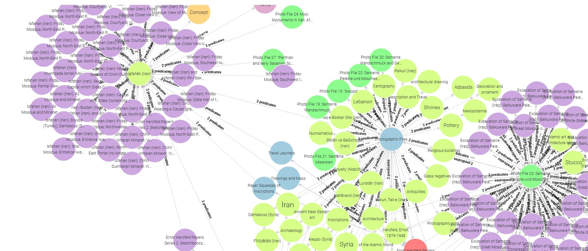

# `On the Construction`...
# Herzfeld Archive Data Extraction and RDF Transformation

This repository contains tools to extract metadata from the [Ernst Herzfeld Papers](https://sova.si.edu/record/fsa.a.06), transform a subset of the data into Turtle (TTL) format using a custom ontology, and query the resulting RDF data with SPARQL. The project focuses on the archival structure of series, subseries, and resources (files and items) from the Smithsonian's Freer and Sackler Archives.
While using the Smithsonian Official API to search for IIIF resources on Ernst Herzfeld, I discovered a significant XML file. It appeared to be the primary data source for Herzfeld's documents on the Smithsonian website.
I extracted relevant data, focusing on the structure of collections, series, and subseries. This file contains well-integrated data with Wikidata, LCSH, and AAT, making it ideal for creating a Knowledge Graph to highlight key entities and their relationships. Despite the advanced technologies at the Smithsonian, including an Open Access RESTful API, they lack a machine-readable catalog.



## Table of Contents
- [Project Overview](#project-overview)
- [Repository Structure](#repository-structure)
- [Prerequisites](#prerequisites)
- [Installation](#installation)
- [Usage](#usage)
- [Ontology](#ontology)
- [Sample Data](#sample-data)
- [SPARQL Queries](#sparql-queries)
- [Contributing](#contributing)
- [License](#license)

## Project Overview
The Ernst Herzfeld Papers (FSA A.06) document the archaeological work of Ernst Herzfeld (1879–1948). This project:
1. **Extracts** metadata from the EAD XML file using Python (`extract_herzfeld_data.py`).
2. **Transforms** a subset of the JSON output into Turtle format using RDFlib (`transform_to_ttl.py`) and a custom ontology (`herzfeld_ontology.ttl`).
3. **Queries** the RDF data with SPARQL examples to retrieve specific information (e.g., resources with digital images).

The sample data focuses on subseries `ref6808` (“Ernst Herzfeld’s Sketchbooks”) with resources like `ref6809` (file) and `ref6810` (item).

## Recent Improvements (Version 2.0)
The extraction workflow has been updated to be more faithful to the XML source and to preserve richer archival evidence for later reconciliation work.

The original extraction script used top-down traversal and missed many resources with valid digital objects (`<dao>` elements). `<dao>` tags can appear at any level, and many `<c level="item">` lack DAOs but still need to be included with (`mdhn:hasDigitalImage false`).
### New Reverse + Hierarchical Strategy
We adopted a **hybrid reverse approach**:
1. **Global DAO discovery** — Find all valid `<dao>` with `ids.si.edu` links (no location assumptions).
2. **Full item scan** — Extract **every** `<c level="item">` / `file`.
3. **Ancestor hierarchy reconstruction** — Walk up the XML tree to assign correct Series / Subseries.
4. **Rich metadata + IIIF support** — Extract titles, scopecontent, physdesc, controlAccess, unit fields, and derive `mdhn:IIIFManifest`.

**Key Improvements**:
- **16,842+ resources** extracted (7,238+ digital).
- **Unique controlled vocabulary** — All `mdhn:controlAccess` terms are SKOS Concepts (ready for AAT/TGN/Wikidata reconciliation) and mapped to their exact or partial matches in AAT, TGM, TGN and WikiData.
- **IIIFManifest** — Automatically generated on digital resources: `https://ids.si.edu/ids/manifest/{id}`.
- **Full hierarchy** — Independent `mdhn:Series` and `mdhn:Subseries` entities with `mdhn:hasResource`, `mdhn:isPartOfSeries`, `mdhn:isPartOfSubseries`.

### What is now captured
- Resources attached directly to series as well as resources nested under other container levels.
- Digital-object and IIIF-manifest relationships for photographs and PDFs when DAO links are present.
- Structured textual notes extracted from `scopecontent` and `arrangement` blocks, including:
  - the `head` as a note heading,
  - the `p` content as detailed paragraphs,
  - owner’s notes and other descriptive information that previously tended to disappear in plain-text extraction.
- Clearer control-access relations for subject, geographic, and genre-form terms.

### Why this matters
These additions make the archive data more suitable for reconciliation with Wikidata, Iconclass, and AAT because the descriptive prose, archival notes, and controlled vocabulary terms are now retained in a more structured form.

### Data output
The generated JSON and Turtle data now include richer resource metadata, explicit note blocks, and more robust hierarchy relations between series, subseries, resources, digital objects, and control-access concepts.

### Source of truth
The new RDF export workflow is designed to treat the EAD XML as the authoritative source. The existing Turtle file remains intact, and a new export file is generated from the XML directly so the archival hierarchy, notes, and DAO links can be reviewed and compared against the source without relying on the JSON intermediate data.

## Repository Structure
```
herzfeld-rdf/
├── extract_herzfeld_data.py      # Script to extract JSON from XML
├── transform_to_ttl.py           # Script to convert JSON to Turtle
├── herzfeld_ontology.ttl         # Custom ontology for Herzfeld data
├── imgsrc                        # Images used in readme.md
├── output.ttl                    # Generated Turtle file
├── queries/
│   ├── query1.rq                 # SPARQL: List items with digital images
│   ├── query2.rq                 # SPARQL: Find resources by control access term
├── README.md                     # This file
└── LICENSE                       # MIT License
```

## Prerequisites
- Python 3.8+
- Libraries: `lxml`, `requests`, `rdflib`
- SPARQL client (e.g., `rdflib` or a triplestore like Apache Jena Fuseki)

## Installation
1. Clone the repository:
   ```bash
   git clone https://github.com/yourusername/herzfeld-rdf.git
   cd herzfeld-rdf
   ```
2. Install dependencies:
   ```bash
   pip install lxml requests rdflib
   ```
3. (Optional) Set up a triplestore (e.g., Fuseki) for SPARQL queries:
   - Download and run Apache Jena Fuseki.
   - Load `output.ttl` into a dataset.

## Usage
1. **Extract JSON**:
   Run the extraction script to download and process the XML:
   ```bash
   python extract_herzfeld_data.py
   ```
   This generates `herzfeld_archive.json`. For testing, use `sample_data.json`.

2. **Transform to Turtle**:
   Convert the JSON to Turtle using the ontology:
   ```bash
   python transform_to_ttl.py
   ```
   This generates `output.ttl`.

3. **Run SPARQL Queries**:
   - Use `rdflib` to query `output.ttl` locally:
     ```python
     from rdflib import Graph
     g = Graph()
     g.parse("output.ttl", format="turtle")
     q = open("queries/query1.rq").read()
     results = g.query(q)
     for row in results:
         print(row)
     ```
   - Or load `output.ttl` into a triplestore and query via its SPARQL endpoint.

## Ontology
The custom ontology (`herzfeld_ontology.ttl`) defines classes and properties for the Herzfeld archive, aligned with Dublin Core and CIDOC-CRM where applicable.
### Extended Ontology (`HezfeldOntology.ttl`)
- New `mdhn:IIIFManifest` datatype property.
- Proper OWL hierarchy (`hasResource` / `hasSubseries` with inverses).
- SKOS Concepts for controlled access terms.
- Alignment with schema.org and previous data style.

### Namespace
- `mdhn: <http://example.org/archival#>`

### Classes
- `mdhn:Series`: A top-level archival series.
- `mdhn:Subseries`: A subdivision of a series.
- `mdhn:Resource`: An archival resource (subclasses: `mdhn:File`, `mdhn:Item`).
- `mdhn:ControlAccessTerm`: A controlled vocabulary term (e.g., geographic or genre).

### Properties
- **Object Properties**:
  - `mdhn:hasSubseries`: Links `Series` to `Subseries`.
  - `mdhn:hasResource`: Links `Subseries` to `Resource`.
  - `mdhn:hasDigitalObject`: Links `Resource` to `DigitalObject`.
  - `mdhn:controlAccess`: Links `Resource` or `Subseries` to `ControlAccessTerm`.
- **Data Properties**:
  - `mdhn:title`, `mdhn:unitid`, `mdhn:scopecontent`, `mdhn:unitdate`, `mdhn:physdesc`.
  - `mdhn:href`, `mdhn:daoTitle` (for `DigitalObject`).
  - `mdhn:termType`, `mdhn:termValue`, `mdhn:altrender`, `mdhn:source`, `mdhn:authfilenumber` (for `ControlAccessTerm`).

### Example
```turtle
@prefix mdhn: <http://example.org/archival#> .
@prefix dc: <http://purl.org/dc/elements/1.1/> .

mdhn:ref6808 a mdhn:Subseries ;
    dc:title "Ernst Herzfeld's Sketchbooks" ;
    mdhn:unitid "2" ;
    mdhn:hasResource herz:ref6809 .

mdhn:ref6809 a mdhn:File ;
    dc:title "SK-I Persien" ;
    mdhn:unitid "FSA A.06 02.01.01" ;
    mdhn:hasDigitalObject mdhn:dao_ref6809 ;
    mdhn:controlAccess mdhn:ca_persepolis .

mdhn:dao_ref6809 a mdhn:DigitalObject ;
    mdhn:href "https://ids.si.edu/ids/deliveryService?id=FS-FSA_A.06_02.01.01" ;
    mdhn:daoTitle "Excavation of Persepolis (Iran): Sketchbook" .

herz:ca_persepolis a herz:ControlAccessTerm ;
    mdhn:termType "geogname" ;
    mdhn:termValue "Persepolis (Iran)" .
```

## Sample Data
The `sample_data.json` file contains a subset of the Herzfeld archive for testing:
- **Subseries**: `ref6808` (“Ernst Herzfeld’s Sketchbooks”).
- **Resources**:
  - `ref6809` (file): A sketchbook with a digital object.
  - `ref6810` (item): A sketch with a digital image.
- **Fields**: Includes `title`, `unitid`, `control_access` (e.g., “Persepolis (Iran)”), and `dao` (URLs and descriptions).

Example snippet:
```json
{
  "series": [
    {
      "id": "ref6807",
      "title": "Sketchbooks",
      "subseries": [
        {
          "id": "ref6808",
          "title": "Ernst Herzfeld's Sketchbooks",
          "unitid": "2",
          "resources": [
            {
              "id": "ref6809",
              "type": "file",
              "title": "SK-I Persien",
              "unitid": "FSA A.06 02.01.01",
              "control_access": [
                {
                  "type": "geogname",
                  "value": "Persepolis (Iran)",
                  "altrender": "geographic",
                  "source": "lcsh",
                  "authfilenumber": ""
                }
              ],
              "dao": {
                "href": "https://ids.si.edu/ids/deliveryService?id=FS-FSA_A.06_02.01.01",
                "title": "Excavation of Persepolis (Iran): Sketchbook",
                "description": "Excavation of Persepolis (Iran): Sketchbook"
              }
            }
          ]
        }
      ]
    }
  ]
}
```

## SPARQL Queries
The `queries/` directory contains example SPARQL queries to explore the RDF data.

### Query 1: List Series with their label

```sparql
PREFIX schema: <http://schema.org/>
PREFIX rdfs: <http://www.w3.org/2000/01/rdf-schema#>
prefix mdhn: <http://example.org/archival#>
prefix skos: <http://www.w3.org/2004/02/skos/core#> 
select *  {
    ?series a mdhn:Series;
         rdfs:label ?lbl.
}
```

**Example Result**:
```
1  mdhn:ref9924     "Paper Squeezes of Inscriptions"@en
2  mdhn:ref10431    "Records of Samarra Expeditions"@en
3  mdhn:ref10847    "Photographic Files"@en
4  mdhn:ref8672     "Drawings and Maps"@en
5  mdhn:ref6806     "Sketchbooks"@en
6  mdhn:ref8055     "Notebooks"@en
7  mdhn:ref6208     "Travel Journals"@en
```

### Query 2: List Subseries with their label

```sparql
PREFIX schema: <http://schema.org/>
PREFIX rdfs: <http://www.w3.org/2000/01/rdf-schema#>
prefix mdhn: <http://example.org/archival#>
prefix skos: <http://www.w3.org/2004/02/skos/core#> 

select *  {
    ?subseries a mdhn:Subseries;
         rdfs:label ?lbl.
}
```

**Example Result**:
```
?resource: herz:ref6809
?title: "SK-I Persien"
?termValue: "Persepolis (Iran)"
```

### Query 3: List Resources with their parents
Despite the fact that resources organized into Series and Subseries, the immediate parent of some resources are instances of `mdhn:Series`.
Note that the instanxes of `mdhn:Subseries` are associated with their parents via `mdhn:isParetOfSeries` too. 
**isPartOfSeries(x,y) -> (Resource(x) ^ Subseries(x)) ^ Series(y)**
```sparql
PREFIX schema: <http://schema.org/>
PREFIX rdfs: <http://www.w3.org/2000/01/rdf-schema#>
prefix mdhn: <http://example.org/archival#>
prefix skos: <http://www.w3.org/2004/02/skos/core#> 

Select DISTINCT ?resource  ?parent  ?parenttype where{
   {
 
         ?resource mdhn:isPartOfSeries ?parent.
         FILTER Not Exists {?resource mdhn:isPartOSubseries ?anysubseries}
   }
   UNION
   {
         ?resource mdhn:isPartOfSubseries ?parent.  
   }
    OPTIONAL{?parent a ?parenttype }

    FILTER (?parenttype!=schema:Collection)   
}
```

**Example Result**:
```
?resource: herz:ref6809
?title: "SK-I Persien"
?termValue: "Persepolis (Iran)"
```

## Contributing
Contributions are welcome! Please:
1. Fork the repository.
2. Create a feature branch (`git checkout -b feature/your-feature`).
3. Commit changes (`git commit -m 'Add your feature'`).
4. Push to the branch (`git push origin feature/your-feature`).
5. Open a pull request.


**Author**: Grok (built by xAI) in collaboration with MehranDHN
