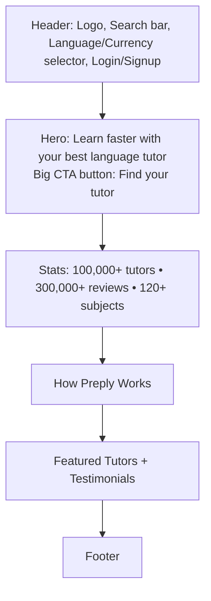
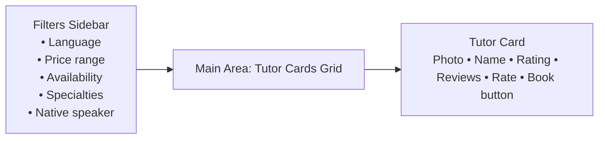
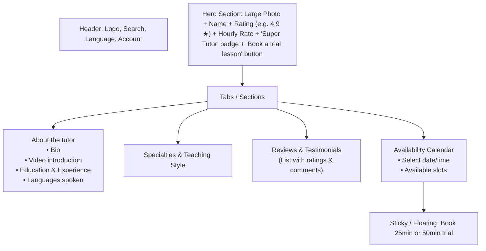
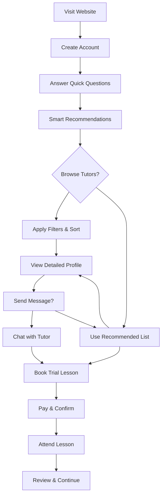
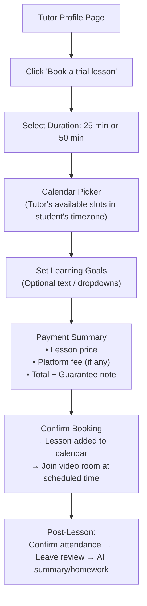
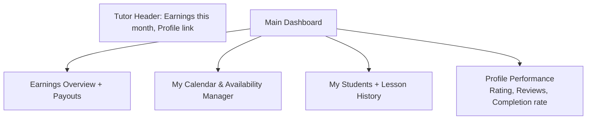
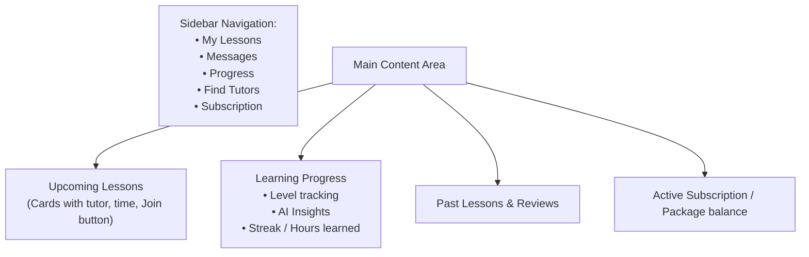
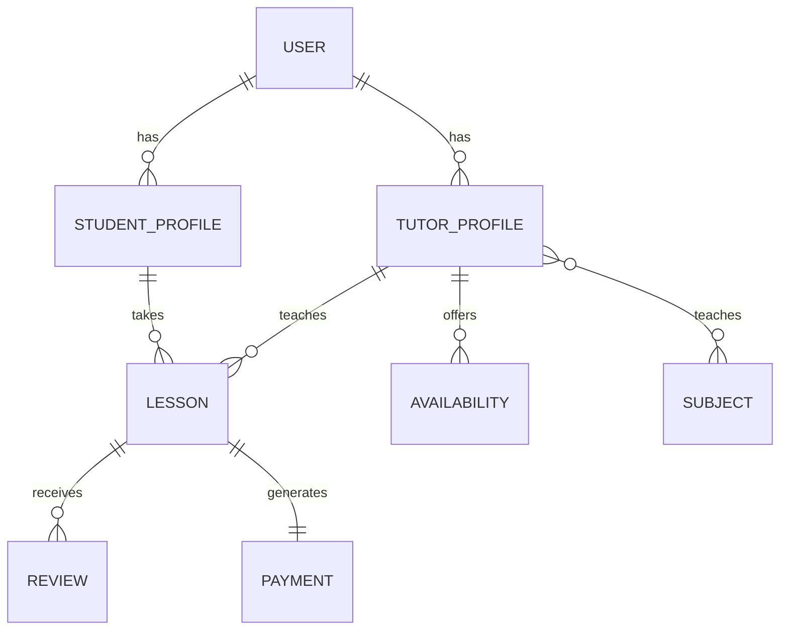

**Preply.com** is a leading two-sided marketplace platform for 1-on-1 online language tutoring (and some other subjects). It connects students (learners) with independent tutors worldwide, emphasizing personalized lessons via video, flexible scheduling, payments, reviews, and progress tools. It also offers corporate training and an app.

This analysis covers key aspects for an **educational clone** (learning purposes only). Focus on core marketplace mechanics, not exact replication.

### 1. Core Features & User Roles
- **Students/Learners**:
  - Browse/search tutors by language, price, availability, specialties (e.g., business English, test prep), native speaker status, reviews, location.
  - Book trial lessons (25/50 min), then packages or subscriptions.
  - Video classroom ("Preply Space"), messaging, progress tracking, AI tools for practice/review.
  - Money-back guarantee/tutor switching; reviews and confirmations post-lesson.
  - Profiles, payments (cards, PayPal, etc.), calendar management.

- **Tutors**:
  - Profile creation (photo, video intro, description, rates, availability, specialties).
  - Approval process (reviewed by Preply team).
  - Set own hourly rates (platform commission: 100% on first trial, then tiered down to ~18%).
  - Manage calendar, teach in virtual classroom, receive payments, access community/webinars.
  - Dashboard for earnings, students, performance.

- **Admin/Platform**:
  - User verification, payments/commissions, moderation, analytics, A/B testing.
  - Corporate features, blog/resources, multi-language support.

**Key Differentiators**: Risk-free trials, personalized matching, built-in video + AI progress tools, flexible subscriptions, global scale (100k+ tutors, millions of lessons).

### 2. UI/UX Design Analysis
Preply uses a **clean, modern, trustworthy design** (React/Next.js frontend, design system with high component coverage).

- **Homepage**: Hero with search/matching CTA ("Find your tutor"), stats (tutors, reviews, subjects), how-it-works steps, featured tutors, testimonials, app promo, footer with links.
- **Search/Tutor Listing**: Filters (price slider, availability, specialties, native speaker, country), sorting, cards with photo/rating/reviews/price/speaks-languages. Infinite scroll or pagination. Personalized recommendations.
- **Tutor Profile**: Bio, video intro, qualifications, reviews, availability calendar, "Book trial" button, rates.
- **Booking Flow**: Select time → goals → payment → confirmation. Calendar integration.
- **Dashboard**: Student — lessons, progress; Tutor — earnings, schedule, students.
- **Classroom**: Video chat with screen share, notes, file sharing.
- **Mobile/App**: Responsive + dedicated apps (React Native). Strong focus on scheduling on-the-go.

**UX Strengths**: Simple 3-step flow (Find → Trial → Progress), trust signals (reviews, guarantee), filters for quick matching, internationalization (languages/currencies). Progressive disclosure (filters, modals). Data-driven iterations and A/B testing.

**Accessibility/Performance**: SSR for SEO (home/search pages critical), good Core Web Vitals focus.

**Wireframe Model (Text/Mermaid Sketch for Key Pages)**:

Use tools like Figma, Penpot, or draw.io for full wireframes. Here's a high-level structure:

**Homepage Hero + How it Works** (Simple Mermaid for layout):

**Tutor Search Page**:
- Top: Filters sidebar (collapsible on mobile) — Price range, Availability, Specialties, etc.
- Main: Grid/List of tutor cards (photo left, info right, book button).
- Pagination/ Load more.

**Tutor Profile**:
- Header: Photo, Name, Rating, Rate.
- Tabs/Sections: About, Reviews, Schedule/Calendar, Specialties.
- Sticky "Book a lesson" button.

For interactive wireframes, prototype in Figma with components (cards, modals, calendars). Prioritize mobile-first responsive design.

### 3. User Workflows (Main Flows)
1. **Student Onboarding & Matching**:
   - Sign up/login → Quick quiz for goals → AI/recommendations → Browse/search with filters → View profiles → Message or book trial.

2. **Booking & Lesson**:
   - Select tutor/time (tutor availability calendar) → Specify goals → Pay (or use credits/subscription) → Join classroom at time → Post-lesson: Confirm, review, homework/AI recap.

3. **Tutor Application & Management**:
   - Sign up → Build profile (steps: info, photo, video, description, availability) → Approval (5 business days) → Set rate → Get bookings → Teach & get paid.
   - Tutor Dashboard (Simplified)

4. **Payments & Subscriptions**:
   - Students: Prepay packages/subscriptions (recurring every 28 days). Tutors: Platform takes commission, pays out (PayPal etc.).
   - Guarantees/refunds handled by platform.

5. **Progress & Retention**: AI insights, self-study, reviews drive repeats/switches.

6. Student Dashboard

**Admin/Moderation**: Profile approval, dispute resolution, analytics.

### 4. Database Structure (Suggested Schema)
Preply likely uses **PostgreSQL** (common with Django) + caching (Redis). No public schema exists, so here's a **practical relational ER-inspired design** for a clone (inspired by standard marketplace + learning platforms).

**Core Entities** (simplified):
- **Users** (base for Students & Tutors; use role or separate profiles): id, email, password_hash, name, role (student/tutor/admin), locale, timezone, created_at, etc.
- **TutorProfiles**: user_id (FK), bio, video_url, hourly_rate, is_approved, background_check_status, specialties (array/JSON or junction table), languages_spoken, avg_rating, total_lessons, etc.
- **StudentProfiles**: user_id (FK), learning_goals, level, preferences (JSON).
- **Subjects/Languages**: id, name, category (language/math/etc.).
- **TutorSubjects**: tutor_id, subject_id, expertise_level.
- **Availability/Slots**: tutor_id, start_time, end_time, is_booked (or use calendar events).
- **Lessons/Bookings**: id, student_id, tutor_id, subject_id, start_time, duration (25/50), status (scheduled/completed/cancelled), price, platform_fee, video_room_id, notes.
- **Payments/Transactions**: id, lesson_id/user_id, amount, status, payment_method, stripe/paypal_ref, commission_rate.
- **Reviews**: id, lesson_id, reviewer_id (student), reviewee_id (tutor), rating, comment, created_at.
- **Subscriptions/Packages**: id, student_id, tutor_id, lessons_per_period, period_days, next_billing, status.
- **Messages/Chat**: For in-app comms (or integrate Twilio/CometChat).
- **Progress/AI Insights**: lesson_id, summary, homework (JSON/Integration with GraphDB and TripleStores for deep Analysis process).

**Relationships**:
- User 1:N TutorProfile/StudentProfile.
- Tutor 1:N Lessons (as tutor), Student 1:N Lessons.
- Many-to-many: Tutors-Subjects.
- Lessons link to Payments, Reviews.

**ER Sketch (Mermaid)**:

**Additional**:
- Use `JSONB` or `Turtle` for flexible data (goals, metadata).
- Indexes on search fields (rates, times, ratings).
- Audit logs for changes (approvals, payments).
- Separate tables for notifications, files (lesson materials).

Scale with sharding/partitions for lessons/payments at high volume. Use Snowflake-like warehouse for analytics.

**Tech Stack Recommendations for Clone** (Educational, Modern):
- **Frontend**: `.Net Blazor` or  `Next.js (React)` + `TypeScript` + `Tailwind/shadcn` for design system. `SSR` for `SEO`.
- **Backend**: `.Net C#` or `Python/Django` (matches Preply) or `Node.js/NestJS/FastAPI`.
- **Database**: PostgreSQL + Redis (caching/sessions/queues).
- **Auth**: `Identity`, `NextAuth` or `Django Allauth` + `JWT`.
- **Payments**: Stripe/PayPal.
- **Video**: WebRTC (e.g., Daily.co, LiveKit) or integrate Twilio/Agora.
- **Search**: `PostgreSQL` full-text or `Elasticsearch`.
- **Deployment**: `Docker`, `Kubernetes` (as Preply does), `AWS`.
- **AI/Extras**: `OpenAI` for matching/progress summaries.

**Open-Source Inspirations/Clones**: Look for marketplace templates (Sharetribe for no-code start), edtech scripts, or GitHub tutor platforms. Build iteratively: MVP with auth + profiles + basic booking.

**Implementation Tips**:
- Presentation only approach focusing on UI/UX.
- implementation of user auth, profiles, search/filters.
- Prioritize calendar (use libraries like react-big-calendar).
- Implement commission logic and guarantees carefully.
- Focus on trust (reviews, verification, moderation).
- Test flows end-to-end; add A/B for experiments.
- Legal: Privacy (GDPR), terms, payments compliance.

